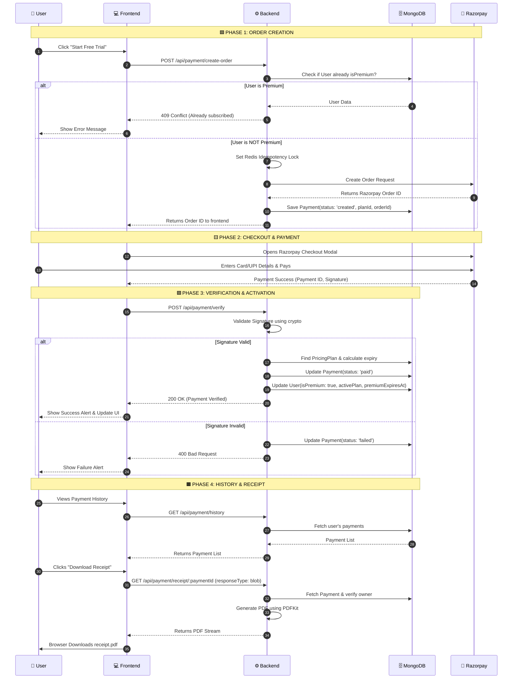

# Payment & Subscription Flow Diagram

Below is the complete sequence diagram illustrating how the payment and subscription lifecycle works across the Frontend, Backend, Razorpay, and Database.

## Roles & Permissions

- **User (Standard)**: Can view pricing plans, initiate a checkout, verify payment, view their payment history, and download their own receipts. 
- **Admin**: Has all User privileges, plus the ability to create, update, and delete pricing plans via the `/api/pricing/admin` endpoints. 

---

