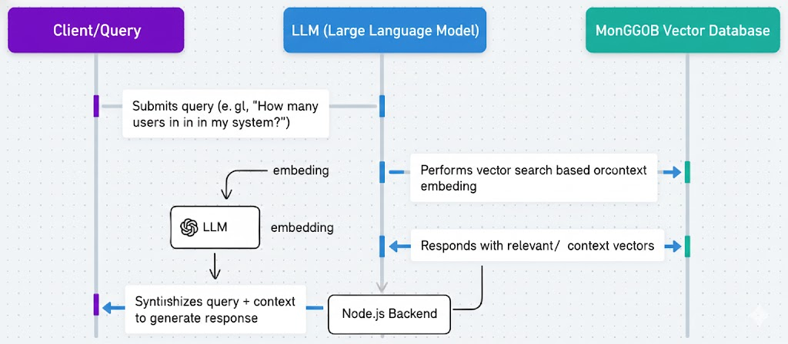

# RAG (Retrieval-Augmented Generation) in Visuiliaze Quiz App

## Overview

The Visuiliaze Quiz App implements a sophisticated Retrieval-Augmented Generation (RAG) system that enables natural language querying of the application's database. This system allows users to ask questions about users, channels, quizzes, and attempts in plain English and receive intelligent, context-aware answers.

## Architecture



### Components

1. **Vector Store**: MongoDB Atlas Vector Search for semantic similarity search
2. **Embeddings**: Google Generative AI (text-embedding-004) for text vectorization (Deperacted);

`
const ai = new GoogleGenAI({apiKey: ""});

    const response = await ai.models.embedContent({
        model: 'gemini-embedding-001',
        contents: 'What is the meaning of life?',
    });

    https://ai.google.dev/gemini-api/docs/changelog#01-14-2026
`

3. **LLM**: Google Gemini 2.5 Flash for natural language generation
4. **Data Sources**: Users, Channels, Questions (Quizzes), Attempts

### Data Flow

```
User Query → Embedding Generation → Vector Search → Context Retrieval → LLM Answer Generation → Response
```

## How RAG Works

### 1. Content Indexing

The system indexes database content into a vector store for semantic search:

- **Users**: Username, email, roles, creation date, last activity
- **Channels**: Name, description, owner, member count, visibility
- **Questions**: Question text, channel association, creator, marks
- **Attempts**: User performance, scores, submission timestamps

### 2. Query Processing

1. **Validation**: Ensures query ends with "?" (must be a question)
2. **Embedding**: Converts query to 768-dimensional vector using Google AI
3. **Vector Search**: Finds semantically similar content using MongoDB Atlas
4. **Context Assembly**: Retrieves top 3 most relevant documents
5. **Answer Generation**: Uses Gemini to generate natural language response

### 3. Diagram Generation

The system can generate visualization data based on natural language queries:

- Supports bar charts, pie charts, line charts
- Returns JSON data for frontend rendering
- Uses AI to interpret query intent

## API Endpoints Fake sample

### Query RAG System
```
POST /api/v1/rag/query
```

**Request Body:**
```json
{
  "query": "How many users are there?",
  "filters": {
    "username": "john_doe",
    "topic": "mathematics",
    "dateRange": {
      "start": "2024-01-01",
      "end": "2024-12-31"
    }
  }
}
```

**Response:**
```json
{
  "success": true,
  "data": {
    "answer": "Based on the current database, there are 150 active users in the system...",
    "sources": [
      {
        "_id": "...",
        "text": "User: john_doe, Email: john@example.com...",
        "type": "user",
        "score": 0.95
      }
    ],
    "metadata": {
      "query": "How many users are there?"
    }
  }
}
```

### Generate Diagram
```
POST /api/v1/rag/diagram
```

**Request Body:**
```json
{
  "query": "Show user registration trends"
}
```

**Response:**
```json
{
  "success": true,
  "data": {
    "type": "line",
    "title": "User Registration Trends",
    "data": [10, 25, 45, 67, 89],
    "labels": ["Jan", "Feb", "Mar", "Apr", "May"],
    "description": "Monthly user registration growth"
  }
}
```

### Index Database Content (Admin)
```
POST /api/v1/rag/index
```

**Response:**
```json
{
  "success": true,
  "message": "Database content indexed successfully"
}
```

### Initialize Vector Store (Admin)
```
POST /api/v1/rag/initialize
```

**Response:**
```json
{
  "success": true,
  "message": "Vector store initialized successfully"
}
```

## Testing RAG Functionality

### Test Script

The `rag-vector-search.js` script provides comprehensive understand of the RAG system:

```javascript
// Run with: node rag-vector-search.js
const mongoose = require('mongoose');
require('dotenv').config();

async function testRAG() {
  try {
    // Connect to database
    await mongoose.connect(process.env.MONGODB_URI || 'mongodb://localhost:27017/blog-app');
    console.log('✅ Connected to MongoDB');

    // Import RAG service
    const RAGService = require('./dist/services/rag.service').default;

    // Test queries
    const testQueries = [
      "How many users are there?",
      "What channels exist?",
      "Show me quiz information",
      "Tell me about user attempts"
    ];

    for (const query of testQueries) {
      console.log(`\n🔍 Testing query: "${query}"`);
      const result = await RAGService.query({ query });
      console.log(`📝 Answer: ${result.answer.substring(0, 200)}...`);
      console.log(`📚 Sources: ${result.sources.length}`);
    }

    // Test diagram generation
    const diagramResult = await RAGService.generateDiagram("Show user registration trends");
    console.log('Diagram result:', diagramResult);

  } catch (error) {
    console.error('❌ RAG test failed:', error);
  } finally {
    await mongoose.disconnect();
  }
}

testRAG();
```

### Running Tests

1. Ensure MongoDB is running
2. Set up environment variables (GEMINI_API_KEY, MONGODB_URI)
3. Run: `node rag-vector-search.js`

### Expected Test Output

```
✅ Connected to MongoDB
Indexing database content...
✅ Database content indexed for RAG

🔍 Testing query: "How many users are there?"
📝 Answer: Based on the retrieved information, there are currently 150 active users in the system...
📚 Sources: 3

🔍 Testing query: "What channels exist?"
📝 Answer: The system contains several channels including Mathematics, Science, and History...
📚 Sources: 2

📊 Testing diagram generation...
Diagram result: { type: "line", title: "User Registration Trends", ... }

✅ RAG testing completed
```

## Configuration

### Environment Variables

```env
GEMINI_API_KEY=your_google_ai_api_key
MONGODB_URI=mongodb://localhost:27017/your_database
```

### Dependencies

```json
{
  "@google/generative-ai": "^0.2.0",
  "@langchain/google-genai": "^0.0.1",
  "@langchain/mongodb": "^0.0.1"
}
```

## Error Handling

The RAG system includes comprehensive error handling:

- **400**: Invalid query (must end with "?")
- **500**: Service initialization failures
- **500**: Query processing errors
- **500**: LLM generation failures

## Security Considerations

- All RAG endpoints require authentication
- Admin-only endpoints for indexing and initialization
- Input validation for query format
- Rate limiting should be applied to prevent abuse

## Performance Optimization

- Vector search uses MongoDB Atlas for scalability
- Embedding generation is cached where possible
- Batch processing for content indexing
- Configurable result limits (currently 3 sources)

## Future Enhancements

- Diagram generation snippet added [IMPORTANT][CODE ADDED]
- Create index [IMPORTANT][CODE ADDED]
- Support for more data types (feedback, logs)
- Advanced filtering capabilities
- Multi-modal responses (text + charts)
- Conversation memory for follow-up queries
- Custom fine-tuning for domain-specific knowledge
